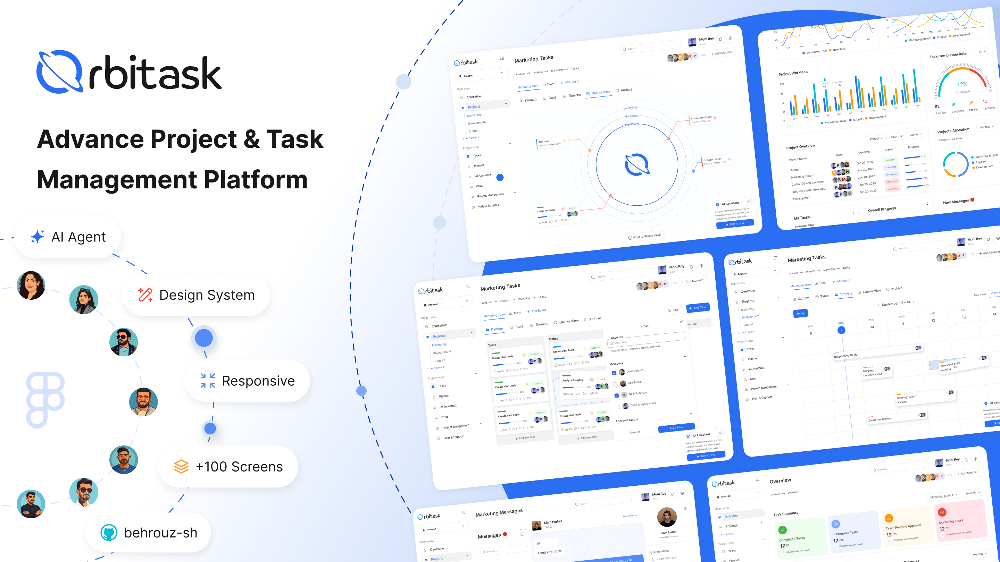

# 🪐 Orbitask — Advanced Project & Task Management Platform



> A pixel-perfect frontend implementation of an open-source Figma community project, built for portfolio purposes.


---

## 📌 Overview

**Orbitask** is a modern, feature-rich project and task management platform. This repository contains my **frontend implementation** of the original Orbitask design — an open-source Figma project created by a team of talented UI/UX designers over a focused two-month collaboration.

The original design was built through deep UX research, user interviews, surveys, and a 12-tool competitor analysis covering platforms like **Asana**, **Jira**, and **Trello**. The result is a clean, intuitive system that addresses real gaps in usability, permission control, automation, and AI-assisted workflows.

> ⚠️ **Disclaimer:** This is a **portfolio project** — a frontend-only implementation of an open-source Figma Community design. The original design is free to use for learning and practice. No commercial use intended.

---

## ✨ Key Features (from the original design)

| Feature                          | Description                                                             |
| -------------------------------- | ----------------------------------------------------------------------- |
| 🌌 **Galaxy View**               | Unique orbital visualization of task priorities and deadlines           |
| 🤖 **Orbi AI Assistant**         | AI-powered assistant to help prioritize tasks and manage workflows      |
| ⚡ **Automation Builder**        | Flexible rule-based automation for team workflows                       |
| ♿ **Accessibility Controls**    | Detailed, action-based accessibility settings — beyond most competitors |
| 📋 **Reusable Component System** | Consistent design system with responsive layouts                        |
| 👥 **Permission Control**        | Granular team permission management                                     |

---

## 🛠️ Tech Stack

```
Frontend
├── Framework    → Next.js 15 (App Router)
├── UI Library   → React 19
├── Styling      → Tailwind CSS 4
└── Icons        → Magicoon Icon Set
```

> 🔧 **Backend:** Not implemented yet — planned for a future update.

---

## 🚀 Getting Started

### Prerequisites

- Node.js `v18+`
- npm or yarn or pnpm

### Installation

```bash
# Clone the repository
git clone https://github.com/YOUR_USERNAME/orbitask.git

# Navigate into the project
cd orbitask

# Install dependencies
npm install

# Start the development server
npm run dev
```

Open [http://localhost:3000](http://localhost:3000) in your browser.

### Build for Production

```bash
npm run build
npm run start
```

---

## 📁 Project Structure

```
orbitask/
├── app/
│   ├── layout.tsx
│   ├── page.tsx
│   └── (routes)/
├── components/
│   ├── ui/
│   └── shared/
├── public/
│   └── assets/
├── styles/
│   └── globals.css
└── README.md
```

---

## 🎨 Design Credits

This project is based on **Orbitask**, an open-source UI/UX design published on the [Figma Community](https://www.figma.com/community).

The original design was crafted by a team of 6 designers and mentors:

| Name             | Role                  |
| ---------------- | --------------------- |
| Parsa Ghiyasi    | UI/UX Designer        |
| Zeinab Saadat    | UI/UX Designer        |
| Hasan Ahmadian   | UI/UX Designer        |
| Marzieh Nassabeh | Senior UI/UX Designer |
| Behshad Davoudi  | Product Design Lead   |
| Hamed Tavana     | Teaching Assistant    |
| Ehsan Ezzati     | Mentor                |

> 🔗 [View Original Figma Design](https://www.figma.com/community/file/1573395792092234125)

### Design Resources Used (in original Figma project)

- **Typeface:** [Inter](https://fonts.google.com/specimen/Inter) — Google Fonts
- **Icons:** Magicoon Icon Set
- **Figma Plugins:** Unsplash, Free Vectorizer, Iconlab, Shades, Content Reel
- **Content Tools:** ChatGPT, Gemini, Grammarly

---

## 🗺️ Roadmap

- [x] Frontend implementation (UI components & pages)
- [x] Responsive layouts
- [ ] Backend API integration
- [ ] Authentication system
- [ ] Real-time data & collaboration features
- [ ] Database integration

---

## 🤝 Contributing

This is a personal portfolio project and is not open for contributions at this time. Feel free to fork it for your own learning!

---

## 📄 License

- **Code (this repo):** MIT License
- **Original Design:** Open-source, free for practice and learning — published on Figma Community by the Orbitask team.

---

## 🙋 About This Implementation

This project was coded by **[Your Name]** as a frontend practice exercise to strengthen skills in:

- **Next.js App Router** architecture
- **Tailwind CSS** component styling
- Translating high-fidelity **Figma designs to code**
- Building **reusable React components**

---

<p align="center">
  Design by the <strong>Orbitask Team</strong> on Figma Community &nbsp;·&nbsp; Code by <strong>Behrouz</strong>
</p>
